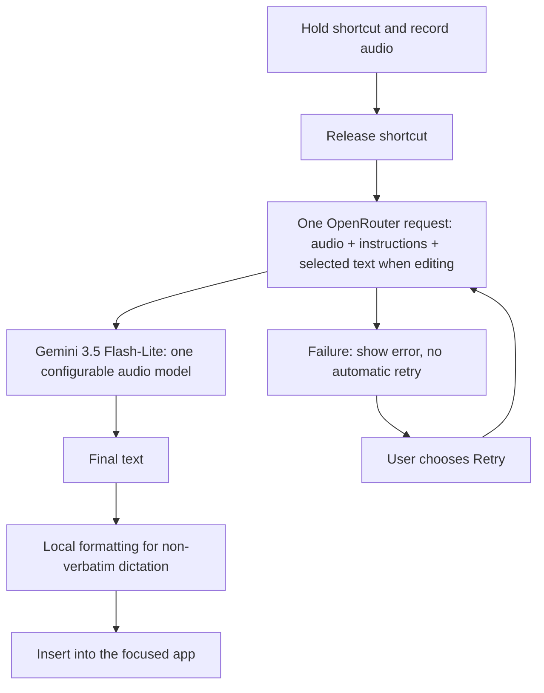

<p align="center">
  
</p>

<h1 align="center">ChatterKey</h1>
<p align="center"><strong>Native AI voice typing for macOS.</strong></p>
<p align="center">Hold <kbd>Fn</kbd>, speak naturally, and release. ChatterKey prepares polished text and inserts it into the app you are already using.</p>

<p align="center">
  <a href="https://github.com/imhimansu28/ChatterKey/releases/latest"></a>
  
  
  <a href="LICENSE"></a>
</p>

<p align="center">
  <strong><a href="https://github.com/imhimansu28/ChatterKey/releases/download/v4.5.0/ChatterKey-v4.5.0.zip">Download for macOS</a></strong>
  &nbsp;·&nbsp;
  <a href="https://imhimansu28.github.io/ChatterKey/">Product website</a>
  &nbsp;·&nbsp;
  <a href="CHANGELOG.md">Changelog</a>
</p>

> [!IMPORTANT]
> ChatterKey is bring-your-own-key software. Audio and processing instructions go directly to OpenRouter for your selected audio-capable model—there is no ChatterKey account, analytics SDK, or project-operated transcription proxy.

## New in v4.5.0 — One model. One request.

Gemini 3.5 Flash-Lite now handles dictation, translation, cleanup, verbatim, and Magic Voice Edit through **one OpenRouter model request per attempt**. No separate transcription/polishing stages, hidden repair calls, or automatic retries. Settings expose one editable audio-model ID, and the dashboard estimates audio and text tokens for that request.

- Improved selection detection for apps with limited Accessibility support.
- Voice edits send selected text and instruction audio together.
- Existing preferences and local history migrate; provider API keys are never transferred.
- Read the [release announcement](docs/releases/v4.5.0.md) or [full changelog](CHANGELOG.md#450---2026-09-08).

> [!WARNING]
> The downloadable v4.5.0 app is an **Apple Silicon (arm64) community-test build**, ad-hoc signed and **not Apple-notarized**. It is not a Developer ID-signed production build. Requires macOS 14 or later. Review [distribution limitations](DISTRIBUTION.md) before installing.

## See it in action

<p align="center">
  
</p>

## Why ChatterKey?

| Regular dictation | ChatterKey |
| --- | --- |
| Returns a raw transcript | Produces polished, ready-to-use text |
| Uses a fixed service or model | Uses one configurable audio model, defaulting to Gemini 3.5 Flash-Lite via OpenRouter |
| Misspells names and technical terms | Learns exact spellings through personal vocabulary |
| Hides the writing instructions | Lets you edit and preview the AI system prompt |
| Requires separate billing checks | Estimates whole-process provider cost locally |
| Keeps features scattered | Unifies Dashboard, History, prompts, models, vocabulary, and snippets in Settings |

## Everything in one voice workflow

<table>
<tr>
<td width="50%" valign="top">

### 🎙 Capture and write

- Configurable hold-to-talk shortcut
- Optional on-device live transcript preview
- Automatic insertion into the focused app
- Eight writing modes, including professional, concise, technical, bullets, translation, and verbatim

</td>
<td width="50%" valign="top">

### ✨ Edit with your voice

- Select existing text in any accessible app
- Hold the shortcut and speak an instruction
- Rewrite, translate, shorten, expand, or reformat in place
- Preserve names, URLs, filenames, commands, and technical terms

</td>
</tr>
<tr>
<td width="50%" valign="top">

### 🧠 Make it yours

- Editable system prompt with exact provider-prompt preview
- Personal vocabulary for names and product terms
- Voice snippets that expand reusable text locally
- Spoken formatting commands for paragraphs, bullets, and punctuation

</td>
<td width="50%" valign="top">

### ↗ Understand your usage

- Words spoken, dictations, speaking time, and average WPM
- Daily activity and provider breakdowns
- Single-request cost estimates for audio input, instructions, and text output
- Small suggestions for repeated phrases, filler words, and long thoughts

</td>
</tr>
</table>

## Start in about 30 seconds

1. **Download** the latest release and move `ChatterKey.app` to Applications.
2. **Connect OpenRouter** with your API key; Gemini 3.5 Flash-Lite is the default model.
3. **Allow permissions** for Microphone and Accessibility. Speech Recognition is optional for live preview.
4. **Hold your shortcut**, speak, then release to process and insert the result.

> [!TIP]
> Start with `Translate to English` for multilingual speech, `Professional` for workplace writing, or `Technical` when dictating developer content.

## How it works



1. SwiftUI coordinates the menu-bar app, Settings, Dashboard, History, and floating status UI.
2. AVFoundation captures a temporary WAV recording while optional on-device Speech provides the rough live preview.
3. One audio-capable model receives the recording and instructions in a single OpenRouter request. For Magic Voice Edit, the selected text is included in that same request. There is no separate transcription, polishing, or English-repair call.
4. ChatterKey applies local snippet and formatting rules for non-verbatim dictation, then inserts the final result. Voice edits and verbatim output bypass those local transformations.

Failures are shown to the user; ChatterKey does not automatically retry or fall back to another model. The explicit Retry button starts a new attempt. The optional on-device live preview is not an additional cloud request.


## Transparent by design

| Data | What happens |
| --- | --- |
| **API keys** | Stored in macOS Keychain |
| **Audio** | Sent directly to the configured provider and deleted after successful processing or cancellation |
| **Magic Voice Edit selection** | Sent only when you explicitly use the feature |
| **Dashboard records** | Aggregate metadata stays local; transcript text and audio are not stored there |
| **Transcript history** | Optional, local, retention-controlled, and disabled by default |
| **Cost display** | Local whole-process estimate; the provider invoice remains the final source of truth |

Read the complete [Privacy Policy](PRIVACY.md) and [Security Policy](SECURITY.md).

## Version history

Detailed changes stay in [CHANGELOG.md](CHANGELOG.md). Use these links for release notes and downloads.

| Version | Released | Links |
| --- | --- | --- |
| `v4.5.0` | September 8, 2026 | [Release notes][release-v4.5.0] · [Detailed changes](CHANGELOG.md#450---2026-09-08) |
| `v0.4.0` | August 25, 2026 | [Release notes][release-v0.4.0] · [Detailed changes](CHANGELOG.md#040---2026-08-25) |
| `v0.3.1` | August 25, 2026 | [Release notes][release-v0.3.1] · [Detailed changes](CHANGELOG.md#031---2026-08-25) |
| `v0.3.0` | August 25, 2026 | [Release notes][release-v0.3.0] · [Detailed changes](CHANGELOG.md#030---2026-08-25) |
| `v0.2.4` | August 24, 2026 | [Release notes][release-v0.2.4] · [Detailed changes](CHANGELOG.md#024---2026-08-24) |
| `v0.2.1` | August 24, 2026 | [Release notes][release-v0.2.1] · [Detailed changes](CHANGELOG.md#021---2026-08-24) |
| `v0.2.0` | August 24, 2026 | [Release notes][release-v0.2.0] · [Detailed changes](CHANGELOG.md#020---2026-08-24) |
| `v0.1.0` | August 24, 2026 | [Release notes][release-v0.1.0] · [Detailed changes](CHANGELOG.md#010---2026-08-24) |

<details>
<summary><strong>Build from source</strong></summary>

### Requirements

- macOS 14 or later
- Swift 6 toolchain
- Microphone and Accessibility permissions
- Optional Speech Recognition permission for live preview
- An OpenRouter API key

### Build and install

```bash
swift build
./Scripts/package-app.sh
rm -rf /Applications/ChatterKey.app
ditto dist/ChatterKey.app /Applications/ChatterKey.app
open /Applications/ChatterKey.app
```

The development package is ad-hoc signed. Review [DISTRIBUTION.md](DISTRIBUTION.md) before publishing binaries.

</details>

<details>
<summary><strong>Default provider configuration</strong></summary>

Model availability and pricing change over time, so every model ID and cost-estimation rate remains editable in Settings.

- Provider: OpenRouter, with its official API host fixed for credential safety.
- Audio model: `google/gemini-3.5-flash-lite` for every writing mode, including verbatim and voice edits.
- Replace the single model ID in Settings when adopting another audio-input/text-output model. Update its rates at the same time.
- Gemini 3.5 Flash-Lite standard estimates: $0.30/M audio input tokens, $0.30/M text input tokens, $2.50/M output tokens (checked September 7, 2026).
- Cost estimates use 32 audio tokens/second and approximate text tokens. Selected text is counted for edits; the on-device rough transcript is not billed as another text input. Extra reasoning, retries, failed calls, taxes, and fees are not included.
- Legacy settings migrate to the single-model schema. Existing OpenRouter Gemini selections and local history remain available. Other provider setups move to the Gemini default and require an OpenRouter key; keys are never copied between providers.

</details>

<details>
<summary><strong>Repository safety</strong></summary>

Build output, packaged apps, environment files, certificates, provisioning profiles, local agent files, and common secret files are excluded by `.gitignore`.

Before a public push, run:

```bash
./Scripts/check-public.sh
git status --short
```

Never include API keys, private audio, or transcripts in an issue or pull request.

</details>

## Contributing

Bug reports, feature ideas, documentation improvements, and focused pull requests are welcome. Please include reproducible steps without sharing sensitive content.

## License

MIT — see [LICENSE](LICENSE).

[release-v4.5.0]: https://github.com/imhimansu28/ChatterKey/releases/tag/v4.5.0
[release-v0.4.0]: https://github.com/imhimansu28/ChatterKey/releases/tag/v0.4.0
[release-v0.3.1]: https://github.com/imhimansu28/ChatterKey/releases/tag/v0.3.1
[release-v0.3.0]: https://github.com/imhimansu28/ChatterKey/releases/tag/v0.3.0
[release-v0.2.4]: https://github.com/imhimansu28/ChatterKey/releases/tag/v0.2.4
[release-v0.2.1]: https://github.com/imhimansu28/ChatterKey/releases/tag/v0.2.1
[release-v0.2.0]: https://github.com/imhimansu28/ChatterKey/releases/tag/v0.2.0
[release-v0.1.0]: https://github.com/imhimansu28/ChatterKey/releases/tag/v0.1.0
