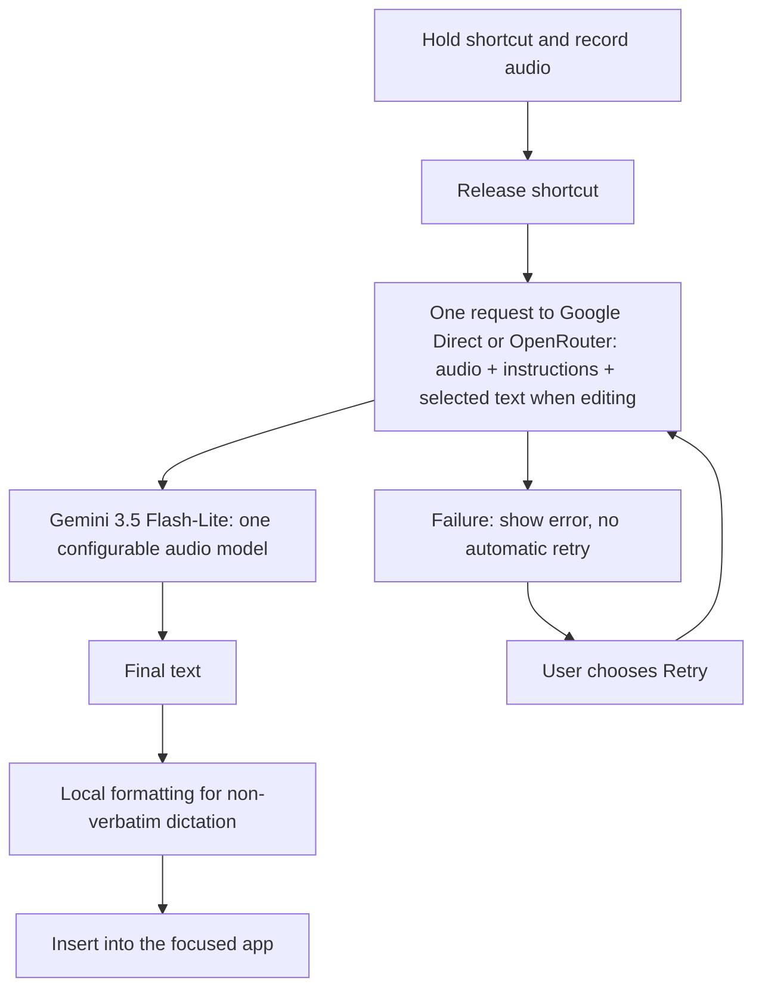

<p align="center">
  
</p>

<h1 align="center">ChatterKey</h1>
<p align="center"><strong>Native AI voice typing for macOS and Android.</strong></p>
<p align="center">Hold <kbd>Fn</kbd> on Mac or the keyboard mic on Android. Speak naturally; review voice edits before replacing text. One shared processing core, separate native apps.</p>

<p align="center">
  <a href="https://github.com/imhimansu28/ChatterKey/releases/tag/macos-v5.0.0"></a>
  <a href="https://github.com/imhimansu28/ChatterKey/releases/tag/android-v1.0.0"></a>
  
  
  <a href="LICENSE"></a>
</p>

<p align="center">
  <strong><a href="https://github.com/imhimansu28/ChatterKey/releases/download/macos-v5.0.0/ChatterKey-macOS-v5.0.0.zip">Download for macOS</a></strong>
  &nbsp;·&nbsp;
  <strong><a href="https://github.com/imhimansu28/ChatterKey/releases/download/android-v1.0.0/ChatterKey-Android-v1.0.0-arm64.apk">Download Android APK</a></strong>
  &nbsp;·&nbsp;
  <a href="https://imhimansu28.github.io/ChatterKey/">Product website</a>
  &nbsp;·&nbsp;
  <a href="CHANGELOG.md">Changelog</a>
</p>

> [!IMPORTANT]
> ChatterKey is bring-your-own-key software. Audio and processing instructions go to Google Direct or OpenRouter, depending on your selected connection—there is no ChatterKey account, analytics SDK, or project-operated transcription proxy.

## Separate releases. One shared core.

| Platform | Current version | Requirements | Release notes |
| --- | --- | --- | --- |
| macOS | **5.0.0 · build 15** | Apple Silicon, macOS 14+; ad-hoc signed, not Apple-notarized | [macOS 5.0.0](docs/releases/macos-v5.0.0.md) |
| Android | **1.0.0 · version code 4** | ARM64 phone, Android 9+; signed release APK | [Android 1.0.0](docs/releases/android-v1.0.0.md) |

Version numbers and release tags are independent: `macos-vX.Y.Z` and `android-vX.Y.Z`. Each release has its own binary and checksum; the repository and reusable Swift core stay shared. There is no Windows build or automatic settings/key synchronization.

**macOS 5.0.0** packages the Mac app independently while making shared response finishing reusable by Android's native transport. Existing single-model dictation, review/protected-value checks, Fn hands-free controls, Keychain accounts and history formats are preserved. Those user-facing features were already introduced in v4.8.0; this is not a new implementation of them.

**Android 1.0.0** is the first signed Android release: a native English (India) keyboard, animated mic/hold and hands-free controls, selected-text review, provider settings and an optional local usage dashboard. See the [full changelog](CHANGELOG.md) for platform-specific changes and validation limits.

### macOS recording controls

With **Settings → General → Recording shortcut → Fn** selected:

- **Hold Fn:** speak while holding, then release to process.
- **Double-tap Fn:** keep recording hands-free; **press Fn again** or use **Stop & Process** to finish.
- **Escape:** cancel recording without sending a processing request.
- A short first Fn tap waits 350 ms for a second tap; ordinary longer holds stop on release. Other shortcuts remain hold-to-talk.
- Hands-free recording continues until stopped or cancelled. The overlay displays the stop/cancel controls. Reconfiguring the shortcut or losing the event tap cancels rather than leaving recording stuck.

Only ChatterKey has changed; no integration or modifications to other applications are required by this build. This does not establish universal selected-text replacement compatibility. The download remains an ad-hoc signed, non-notarized community-test package.

### macOS selected-text review

- Compare the original and proposed text before choosing **Apply to Original**, **Copy & Close**, or **Discard**. Closing the review also discards it.
- Acknowledge detected changes to numbers, email addresses, and HTTP(S)/www URLs before applying. Checks compare literal values and occurrence counts, not factual correctness or meaning; always review the text. URL-adjacent punctuation is kept conservatively and can trigger a warning for an intentional formatting change.
- Apply rechecks the original field, range, and selection. Apps without sufficient Accessibility information use manual Copy recovery instead. There is no automatic retargeting or extra model request.
- Normal dictation keeps its direct-insertion flow. Review data stays in memory; discarded proposals are not added to transcript history. The provider request and its local usage record have already occurred.

See the [ordered product roadmap](ROADMAP.md) for Hindi/Hinglish controls, app-specific preferences, approved corrections, attempt details, and the approved Android keyboard development plan.

## Android keyboard

The native Java keyboard shares the **actual cross-compiled Swift core** through JNI. It includes staggered English (India) QWERTY, Shift/caps lock, full number/symbol pages with ₹, a wide spacebar, long-press digits/delete, animated voice recording and selected-text review. Google Direct and OpenRouter retain separate model preferences and encrypted keys.

- **Dashboard / Settings / Practice:** opt-in local counters, organized provider/writing preferences and a private test editor.
- **Counters:** typed-word estimates and words in final dictation output—not exact spoken words or a net document count. Edits are counted separately. No typed text is stored for analytics; password/private-marked fields and Practice are excluded.
- **Voice:** one audio-model request per attempt; up to two minutes of in-memory recording; no automatic retries or Send. Apply requires the original editor/selection to remain verifiable.
- **Setup:** install the signed APK, then enable/select ChatterKey and allow microphone access in Practice. Enter your own provider API key in Settings and Save. Normal typing does not require a key or internet.
- **Migration:** debug and release signing differ. Remove old debug copies from **all profiles where installed** before the first release install; back up important preferences first. Subsequent release updates reuse the same signing identity.

Read [Android setup, architecture, signing, privacy and test checklist](apps/android/README.md). Build tools/caches stay within the approved 10 GB cap, without an emulator or Android Studio. Signed release installation/launch passed on a physical Android 15 ARM64 phone; earlier debug UI/core fixtures and user spot checks passed. Live release-mode microphone, provider, editor and lifecycle coverage remains incomplete. Android does not yet include Mac history/cost dashboards, local live transcription, predictive typing or full Mac feature parity.

## Google Direct setup

Use your own **Gemini API key directly**, without an OpenRouter account:

1. Open **Settings → AI Provider → Connection → Google Direct**.
2. Enter your Gemini API key from Google AI Studio in the **Gemini API key** field.
3. Keep `gemini-3.5-flash-lite` as the model, then **Save**. Test Connection checks API access; dictate a short clip to check audio-model access.

Requests use Google's fixed OpenAI-compatible endpoint through the existing Swift HTTP client—no extra SDK or second processing stage. Google keys stay in a separate Keychain account from OpenRouter keys. Model and cost-rate settings are retained separately when switching connections. Existing installations keep their working connection; new installs default to Google Direct.

### Still one model. Still one request.

Google Direct and OpenRouter each use **one selected audio model per attempt** for dictation, translation, cleanup, verbatim, and Magic Voice Edit. There are no separate transcription/polishing stages, hidden repair calls, automatic retries, or automatic connection switches.

- **Google Direct:** `gemini-3.5-flash-lite` with your Gemini API key.
- **OpenRouter:** `google/gemini-3.5-flash-lite` with your OpenRouter key, or another supported audio model.
- Existing OpenRouter installations retain their connection, model, and rates. Switching to Google Direct is explicit.
- Google Direct was introduced in [v4.6.0](docs/releases/v4.6.0.md); macOS 5.0.0 and Android 1.0.0 keep the same single-model architecture.

> [!WARNING]
> The downloadable macOS 5.0.0 app is an **Apple Silicon (arm64) community-test build**, ad-hoc signed and **not Apple-notarized**. It is not a Developer ID-signed production build. Requires macOS 14 or later. Review [distribution limitations](DISTRIBUTION.md) before installing.

## See it in action

<p align="center">
  
</p>

## Why ChatterKey?

| Regular dictation | ChatterKey |
| --- | --- |
| Returns a raw transcript | Produces polished, ready-to-use text |
| Uses a fixed service or model | Uses one configurable audio model, defaulting to Gemini 3.5 Flash-Lite via Google Direct, with OpenRouter optional |
| Misspells names and technical terms | Learns exact spellings through personal vocabulary |
| Hides the writing instructions | Lets you edit and preview the AI system prompt |
| Requires separate billing checks | Estimates whole-process provider cost locally |
| Keeps features scattered | Unifies Dashboard, History, prompts, models, vocabulary, and snippets in Settings |

## macOS voice workflow

<table>
<tr>
<td width="50%" valign="top">

### 🎙 Capture and write

- Configurable hold-to-talk shortcut and Fn double-tap hands-free recording
- Optional on-device live transcript preview
- Automatic insertion into the focused app
- Eight writing modes, including professional, concise, technical, bullets, translation, and verbatim

</td>
<td width="50%" valign="top">

### ✨ Edit with your voice

- Select existing text in a supported editable app
- Hold the shortcut and speak an instruction
- Review the proposed rewrite, then Apply to Original or Copy manually
- Preserve names, URLs, filenames, commands, and technical terms

</td>
</tr>
<tr>
<td width="50%" valign="top">

### 🧠 Make it yours

- Editable system prompt with exact provider-prompt preview
- Personal vocabulary for names and product terms
- Voice snippets that expand reusable text locally
- Spoken formatting commands for paragraphs, bullets, and punctuation

</td>
<td width="50%" valign="top">

### ↗ Understand your usage

- Output-word counts, dictations, recording time, and estimated WPM
- Daily activity and provider breakdowns
- Single-request cost estimates for audio input, instructions, and text output
- Small suggestions for repeated phrases, filler words, and long thoughts

</td>
</tr>
</table>

## macOS setup

1. **Download** the macOS release linked above and move `ChatterKey.app` to Applications.
2. **Connect your provider** with its own API key: Google Direct (default for new installs) or OpenRouter.
3. **Allow permissions** for Microphone and Accessibility. Speech Recognition is optional for live preview.
4. **Hold your shortcut**, speak, then release—or double-tap Fn, speak hands-free, and press Fn again to finish. Selected-text edits pause for review.

> [!TIP]
> Start with `Translate to English` for multilingual speech, `Professional` for workplace writing, or `Technical` when dictating developer content.

## macOS selection and paste limitations

Magic Voice Edit uses the **active selection in the focused app**, not text copied earlier. Keep the original field and selection in place until processing finishes. Read-only content cannot be replaced in place, and some apps expose limited Accessibility information.

Selection capture is nonblocking, and the original target is rechecked before pasting. “Paste sent” means the paste event was dispatched, not that the target app confirmed insertion. Clipboard restoration is best-effort: an external app can process a copy or paste after the bounded wait. Review the result and use **Copy transcript** if necessary.

## How the Mac workflow works



1. SwiftUI coordinates the menu-bar app, Settings, Dashboard, History, and floating status UI.
2. AVFoundation captures a temporary WAV recording while optional on-device Speech provides the rough live preview.
3. One audio-capable model receives the recording and instructions in a single request to the selected connection. For Magic Voice Edit, the selected text is included in that same request. There is no separate transcription, polishing, or English-repair call.
4. ChatterKey applies local snippet and formatting rules for non-verbatim dictation, then inserts the final result. Voice edits and verbatim output bypass those local transformations.

Failures are shown to the user; ChatterKey does not automatically retry or fall back to another model. The explicit Retry button starts a new attempt. The optional on-device live preview is not an additional cloud request.

## macOS data handling

| Data | What happens |
| --- | --- |
| **API keys** | Stored in macOS Keychain |
| **Audio** | Sent directly to the configured provider and deleted after successful processing or cancellation |
| **Magic Voice Edit selection** | Sent only when you explicitly use the feature |
| **Dashboard records** | Usage metadata and suggestions stay local; older suggestions may include short repeated phrases. Clear Usage removes them |
| **Transcript history** | Optional, local, retention-controlled, and disabled by default |
| **Cost display** | Local whole-process estimate; the provider invoice remains the final source of truth |

Read the complete [Privacy Policy](PRIVACY.md) and [Security Policy](SECURITY.md).

## Version history

Detailed changes stay in [CHANGELOG.md](CHANGELOG.md). Use these links for release notes and downloads.

| Version | Released | Links |
| --- | --- | --- |
| `macos-v5.0.0` | September 13, 2026 | [Release notes](docs/releases/macos-v5.0.0.md) |
| `android-v1.0.0` | September 13, 2026 | [Release notes](docs/releases/android-v1.0.0.md) |
| `v4.8.0` | September 13, 2026 | [Release notes][release-v4.8.0] · [Detailed changes](CHANGELOG.md#480---2026-09-13) |
| `v4.6.1` | September 12, 2026 | [Release notes](docs/releases/v4.6.1.md) · [Detailed changes](CHANGELOG.md#461---2026-09-12) |
| `v4.6.0` | September 12, 2026 | [Release notes][release-v4.6.0] · [Detailed changes](CHANGELOG.md#460---2026-09-12) |
| `v4.5.0` | September 8, 2026 | [Release notes][release-v4.5.0] · [Detailed changes](CHANGELOG.md#450---2026-09-08) |
| `v0.4.0` | August 25, 2026 | [Release notes][release-v0.4.0] · [Detailed changes](CHANGELOG.md#040---2026-08-25) |
| `v0.3.1` | August 25, 2026 | [Release notes][release-v0.3.1] · [Detailed changes](CHANGELOG.md#031---2026-08-25) |
| `v0.3.0` | August 25, 2026 | [Release notes][release-v0.3.0] · [Detailed changes](CHANGELOG.md#030---2026-08-25) |
| `v0.2.4` | August 24, 2026 | [Release notes][release-v0.2.4] · [Detailed changes](CHANGELOG.md#024---2026-08-24) |
| `v0.2.1` | August 24, 2026 | [Release notes][release-v0.2.1] · [Detailed changes](CHANGELOG.md#021---2026-08-24) |
| `v0.2.0` | August 24, 2026 | [Release notes][release-v0.2.0] · [Detailed changes](CHANGELOG.md#020---2026-08-24) |
| `v0.1.0` | August 24, 2026 | [Release notes][release-v0.1.0] · [Detailed changes](CHANGELOG.md#010---2026-08-24) |

<details>
<summary><strong>Build from source</strong></summary>

### Requirements

- macOS 14 or later
- Swift 6 toolchain
- Microphone and Accessibility permissions
- Optional Speech Recognition permission for live preview
- A Gemini API key for Google Direct, or an OpenRouter API key for OpenRouter

### Source layout

```text
Package.swift                    # One Swift package, separate build targets
core/Sources/ChatterKeyCore/      # Shared processing and value models
apps/macos/Sources/               # Native app, settings and UI
apps/macos/Sources/Adapters/      # Mic, shortcuts, text access, storage and HTTP transport
apps/macos/Resources/             # Mac app icons
apps/android/app/                # Native Android IME, settings, recording and HTTPS adapters
apps/android/bridge/             # Swift C ABI bridge to the same processing core
Scripts/                         # Root-level build, package and regression commands
```

The Mac executable depends on `ChatterKeyCore`; the core does not depend on the app. It owns provider request construction/response parsing, prompts, writing modes, snippets, edit diffs, protected-value checks and estimated usage. The Mac app supplies completed WAV bytes, a settings value conforming to `ProcessingSettings`, and an explicit HTTP transport. Settings migrations, Keychain access, audio capture, live speech preview, Fn gestures, editor verification and window lifecycle stay native.

The core is a Swift module with package-scoped interfaces, not a server. The Android target exposes a narrow C ABI through JNI and cross-compiles these same sources; Android owns its native permissions, storage and editor lifecycle. No automatic sync is included. Mac settings keys, bundle identity and the one-model-request-per-attempt policy are unchanged.

Run `bash Scripts/test-models.sh` to compile the core as a separate module and exercise the existing local/provider regressions through that boundary. Use `--product ChatterKey` for a Mac-only build; Android uses `Scripts/build-android.py`.

### Build and install

```bash
swift build --product ChatterKey
./Scripts/package-app.sh
rm -rf /Applications/ChatterKey.app
ditto dist/ChatterKey.app /Applications/ChatterKey.app
open /Applications/ChatterKey.app
```

The development package is ad-hoc signed. Review [DISTRIBUTION.md](DISTRIBUTION.md) before publishing binaries.

</details>

<details>
<summary><strong>Default provider configuration</strong></summary>

Model availability and pricing change over time, so every model ID and cost-estimation rate remains editable in Settings.

- Connections: Google Direct (new-install default) and OpenRouter. Each uses its fixed official API host and its own Keychain account.
- Audio model: `gemini-3.5-flash-lite` on Google Direct; `google/gemini-3.5-flash-lite` on OpenRouter. Both use one model for all writing modes and voice edits.
- Replace the single model ID in Settings when adopting another audio-input/text-output model. Update its rates at the same time.
- Gemini 3.5 Flash-Lite standard estimates: $0.30/M audio input tokens, $0.30/M text input tokens, $2.50/M output tokens (checked September 7, 2026).
- Cost estimates use 32 audio tokens/second and approximate text tokens. Selected text is counted for edits; the on-device rough transcript is not billed as another text input. Extra reasoning, failed calls, taxes, and fees are not included. Successful explicit retries are counted as completed attempts.
- Legacy settings migrate to the single-model schema. Existing OpenRouter Gemini selections and local history remain available. Unsupported legacy OpenAI/custom setups retain the v4.5 OpenRouter migration path; keys are never copied between providers.

</details>

<details>
<summary><strong>Repository safety</strong></summary>

Build output, packaged apps, environment files, certificates, provisioning profiles, local agent files, and common secret files are excluded by `.gitignore`.

Before a public push, run:

```bash
./Scripts/check-public.sh
git status --short
```

Never include API keys, private audio, or transcripts in an issue or pull request.

</details>

## Contributing

Bug reports, feature ideas, documentation improvements, and focused pull requests are welcome. Please include reproducible steps without sharing sensitive content.

## License

ChatterKey source is MIT — see [LICENSE](LICENSE). The Android APK also includes Swift and other runtime dependencies under their respective licenses; full notices are bundled in [licenses.txt](apps/android/app/src/main/assets/licenses.txt) and available in Android Settings.

[release-v4.8.0]: https://github.com/imhimansu28/ChatterKey/releases/tag/v4.8.0
[release-v4.6.0]: https://github.com/imhimansu28/ChatterKey/releases/tag/v4.6.0
[release-v4.5.0]: https://github.com/imhimansu28/ChatterKey/releases/tag/v4.5.0
[release-v0.4.0]: https://github.com/imhimansu28/ChatterKey/releases/tag/v0.4.0
[release-v0.3.1]: https://github.com/imhimansu28/ChatterKey/releases/tag/v0.3.1
[release-v0.3.0]: https://github.com/imhimansu28/ChatterKey/releases/tag/v0.3.0
[release-v0.2.4]: https://github.com/imhimansu28/ChatterKey/releases/tag/v0.2.4
[release-v0.2.1]: https://github.com/imhimansu28/ChatterKey/releases/tag/v0.2.1
[release-v0.2.0]: https://github.com/imhimansu28/ChatterKey/releases/tag/v0.2.0
[release-v0.1.0]: https://github.com/imhimansu28/ChatterKey/releases/tag/v0.1.0
