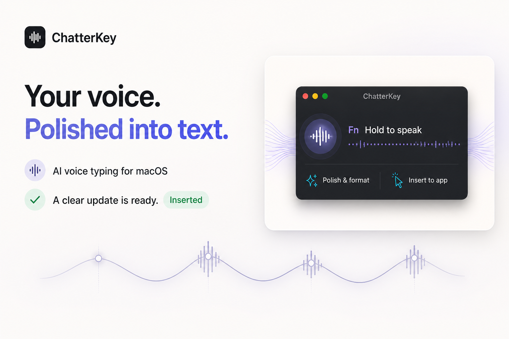
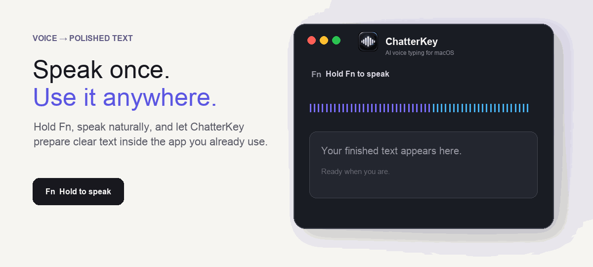

<p align="center">
  
</p>

<h1 align="center">ChatterKey</h1>
<p align="center"><strong>Native AI voice typing for macOS.</strong></p>
<p align="center">Hold <kbd>Fn</kbd>, speak naturally, and release. ChatterKey prepares polished text and inserts it into the app you are already using.</p>

<p align="center">
  <a href="https://github.com/imhimansu28/ChatterKey/releases/latest"></a>
  
  
  <a href="LICENSE"></a>
</p>

<p align="center">
  <strong><a href="https://github.com/imhimansu28/ChatterKey/releases/download/v0.4.0/ChatterKey-v0.4.0.zip">Download for macOS</a></strong>
  &nbsp;·&nbsp;
  <a href="https://imhimansu28.github.io/ChatterKey/">Product website</a>
  &nbsp;·&nbsp;
  <a href="CHANGELOG.md">Changelog</a>
</p>

> [!IMPORTANT]
> ChatterKey is bring-your-own-key software. Audio and processing instructions go directly to the provider you configure—there is no ChatterKey account, analytics SDK, or project-operated transcription proxy.

## See it in action

<p align="center">
  
</p>

## Why ChatterKey?

| Regular dictation | ChatterKey |
| --- | --- |
| Returns a raw transcript | Produces polished, ready-to-use text |
| Uses a fixed service or model | Supports OpenAI, OpenRouter, and compatible custom providers |
| Misspells names and technical terms | Learns exact spellings through personal vocabulary |
| Hides the writing instructions | Lets you edit and preview the AI system prompt |
| Requires separate billing checks | Estimates whole-process provider cost locally |
| Keeps features scattered | Unifies Dashboard, History, prompts, models, vocabulary, and snippets in Settings |

## Everything in one voice workflow

<table>
<tr>
<td width="50%" valign="top">

### 🎙 Capture and write

- Configurable hold-to-talk shortcut
- Optional on-device live transcript preview
- Automatic insertion into the focused app
- Eight writing modes, including professional, concise, technical, bullets, translation, and verbatim

</td>
<td width="50%" valign="top">

### ✨ Edit with your voice

- Select existing text in any accessible app
- Hold the shortcut and speak an instruction
- Rewrite, translate, shorten, expand, or reformat in place
- Preserve names, URLs, filenames, commands, and technical terms

</td>
</tr>
<tr>
<td width="50%" valign="top">

### 🧠 Make it yours

- Editable system prompt with exact provider-prompt preview
- Personal vocabulary for names and product terms
- Voice snippets that expand reusable text locally
- Spoken formatting commands for paragraphs, bullets, and punctuation

</td>
<td width="50%" valign="top">

### ↗ Understand your usage

- Words spoken, dictations, speaking time, and average WPM
- Daily activity and provider breakdowns
- Whole-process cost estimates for transcription and optional polishing
- Small suggestions for repeated phrases, filler words, and long thoughts

</td>
</tr>
</table>

## Start in about 30 seconds

1. **Download** the latest release and move `ChatterKey.app` to Applications.
2. **Choose a provider** and add your API key in the setup guide.
3. **Allow permissions** for Microphone and Accessibility. Speech Recognition is optional for live preview.
4. **Hold your shortcut**, speak, then release to process and insert the result.

> [!TIP]
> Start with `Translate to English` for multilingual speech, `Professional` for workplace writing, or `Technical` when dictating developer content.

## How it works

<p align="center">
  
</p>

1. SwiftUI coordinates the menu-bar app, Settings, Dashboard, History, and floating status UI.
2. AVFoundation captures a temporary WAV recording while optional on-device Speech provides the rough live preview.
3. The selected provider transcribes the audio and optionally applies the active writing mode and editable system instructions.
4. ChatterKey applies local snippet and formatting rules, then macOS Accessibility inserts the final result.

## Transparent by design

| Data | What happens |
| --- | --- |
| **API keys** | Stored in macOS Keychain |
| **Audio** | Sent directly to the configured provider and deleted after successful processing or cancellation |
| **Magic Voice Edit selection** | Sent only when you explicitly use the feature |
| **Dashboard records** | Aggregate metadata stays local; transcript text and audio are not stored there |
| **Transcript history** | Optional, local, retention-controlled, and disabled by default |
| **Cost display** | Local whole-process estimate; the provider invoice remains the final source of truth |

Read the complete [Privacy Policy](PRIVACY.md) and [Security Policy](SECURITY.md).

## Version history

Detailed changes stay in [CHANGELOG.md](CHANGELOG.md). Use these links for release notes and downloads.

| Version | Released | Links |
| --- | --- | --- |
| `v0.4.0` | August 25, 2026 | [Release notes][release-v0.4.0] · [Detailed changes](CHANGELOG.md#040---2026-08-25) |
| `v0.3.1` | August 25, 2026 | [Release notes][release-v0.3.1] · [Detailed changes](CHANGELOG.md#031---2026-08-25) |
| `v0.3.0` | August 25, 2026 | [Release notes][release-v0.3.0] · [Detailed changes](CHANGELOG.md#030---2026-08-25) |
| `v0.2.4` | August 24, 2026 | [Release notes][release-v0.2.4] · [Detailed changes](CHANGELOG.md#024---2026-08-24) |
| `v0.2.1` | August 24, 2026 | [Release notes][release-v0.2.1] · [Detailed changes](CHANGELOG.md#021---2026-08-24) |
| `v0.2.0` | August 24, 2026 | [Release notes][release-v0.2.0] · [Detailed changes](CHANGELOG.md#020---2026-08-24) |
| `v0.1.0` | August 24, 2026 | [Release notes][release-v0.1.0] · [Detailed changes](CHANGELOG.md#010---2026-08-24) |

<details>
<summary><strong>Build from source</strong></summary>

### Requirements

- macOS 14 or later
- Swift 6 toolchain
- Microphone and Accessibility permissions
- Optional Speech Recognition permission for live preview
- An API key for the selected cloud provider

### Build and install

```bash
swift build
./Scripts/package-app.sh
rm -rf /Applications/ChatterKey.app
ditto dist/ChatterKey.app /Applications/ChatterKey.app
open /Applications/ChatterKey.app
```

The development package is ad-hoc signed. Review [DISTRIBUTION.md](DISTRIBUTION.md) before publishing binaries.

</details>

<details>
<summary><strong>Default provider configuration</strong></summary>

Model availability and pricing change over time, so every model ID and cost-estimation rate remains editable in Settings.

- OpenAI transcription: `gpt-4o-mini-transcribe`
- OpenAI cleanup: `gpt-4.1-mini`
- OpenRouter transcription fallback: `openai/whisper-large-v3`
- OpenRouter fast audio processing: `google/gemini-3.5-flash-lite`

</details>

<details>
<summary><strong>Repository safety</strong></summary>

Build output, packaged apps, environment files, certificates, provisioning profiles, local agent files, and common secret files are excluded by `.gitignore`.

Before a public push, run:

```bash
./Scripts/check-public.sh
git status --short
```

Never include API keys, private audio, or transcripts in an issue or pull request.

</details>

## Contributing

Bug reports, feature ideas, documentation improvements, and focused pull requests are welcome. Please include reproducible steps without sharing sensitive content.

## License

MIT — see [LICENSE](LICENSE).

[release-v0.4.0]: https://github.com/imhimansu28/ChatterKey/releases/tag/v0.4.0
[release-v0.3.1]: https://github.com/imhimansu28/ChatterKey/releases/tag/v0.3.1
[release-v0.3.0]: https://github.com/imhimansu28/ChatterKey/releases/tag/v0.3.0
[release-v0.2.4]: https://github.com/imhimansu28/ChatterKey/releases/tag/v0.2.4
[release-v0.2.1]: https://github.com/imhimansu28/ChatterKey/releases/tag/v0.2.1
[release-v0.2.0]: https://github.com/imhimansu28/ChatterKey/releases/tag/v0.2.0
[release-v0.1.0]: https://github.com/imhimansu28/ChatterKey/releases/tag/v0.1.0
