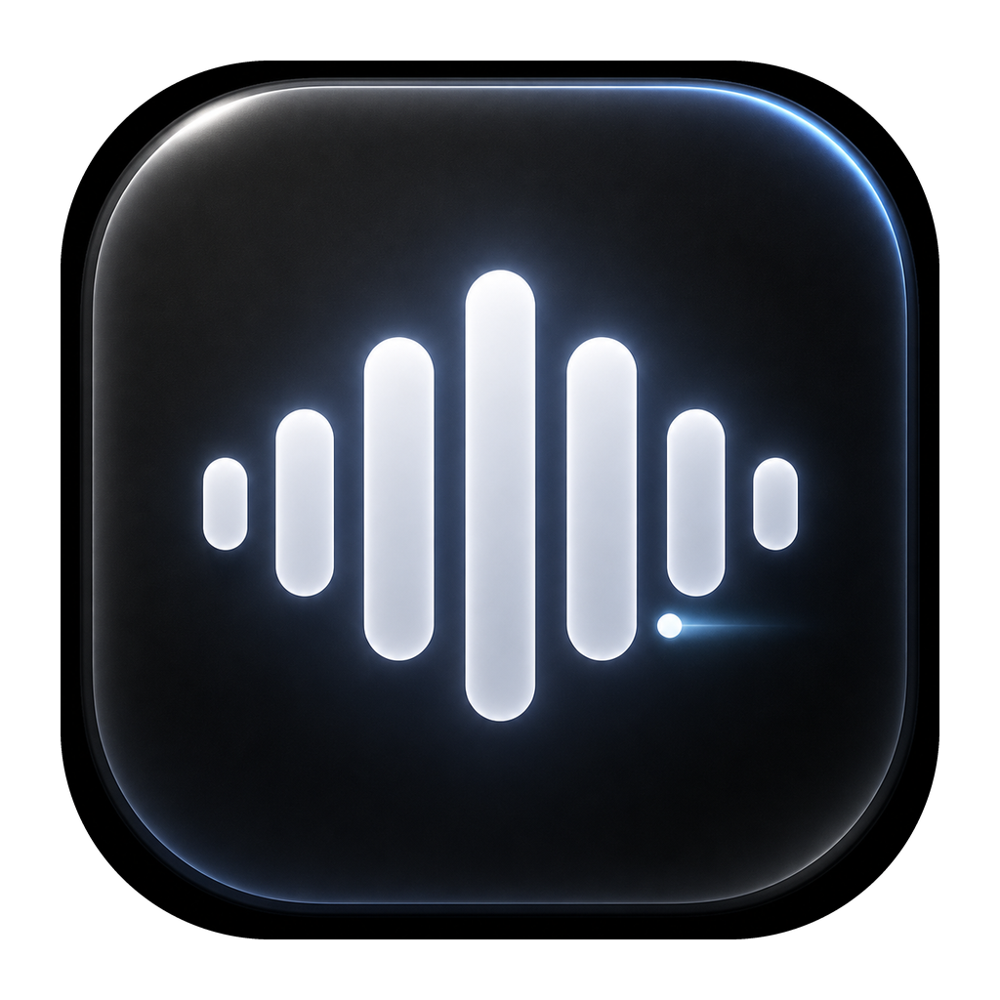
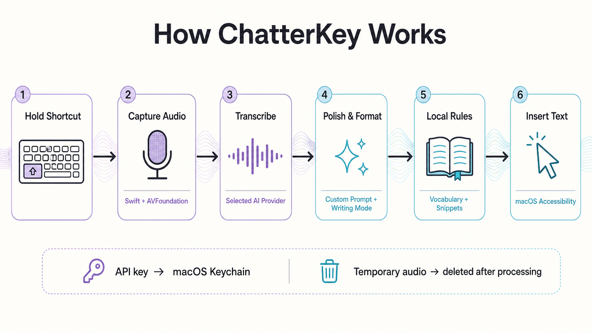

<p align="center">
  
</p>

<h1 align="center">ChatterKey</h1>
<p align="center"><strong>AI Voice Typing for macOS</strong></p>

Hold **Fn**, speak naturally, and release. ChatterKey converts speech into polished text and inserts it into the focused macOS app.

> Bring your own API key. Audio is sent directly to the provider selected by the user; this project does not operate a transcription proxy or collect analytics.

## Website

Visit the ChatterKey product page: **https://imhimansu28.github.io/ChatterKey/**

## How ChatterKey works

<p align="center">
  
</p>

1. A native SwiftUI menu-bar app listens for the configured hold-to-talk shortcut.
2. AVFoundation records a temporary WAV file and optionally shows an on-device live preview.
3. The app sends audio directly to the selected provider for transcription.
4. The selected writing mode, editable system prompt, vocabulary, and formatting rules guide the final result.
5. Local processing expands voice snippets and normalizes spoken formatting commands.
6. macOS Accessibility inserts the finished text into the currently focused app.

### Transparent by design

- **Editable AI instructions:** The core system prompt is visible and customizable in **Settings → AI Instructions**.
- **Direct provider connection:** Audio, prompts, and selected text used by Magic Voice Edit go directly to the provider configured by the user.
- **Local secrets and preferences:** API keys stay in macOS Keychain; preferences, custom instructions, and aggregate usage metrics are stored locally.
- **Temporary audio:** Recordings are deleted after successful processing or cancellation, with short-lived retention only when an explicit retry is available.
- **No hidden collection layer:** ChatterKey has no account requirement, analytics SDK, advertising SDK, or project-operated transcription proxy.

## Features

- Editable custom system prompt with a clearly documented automatic context layer
- Personal vocabulary, local voice snippets, writing modes, and spoken formatting commands
- Bring-your-own provider, API key, transcription model, and polishing model
- Live transcription preview and Magic Voice Edit
- Local dashboard for words spoken, speaking time, estimated provider cost, and communication insights

## Version history

Detailed changes stay in [CHANGELOG.md](CHANGELOG.md). Use the version links below for downloads and release notes.

| Version | Released | Links |
| --- | --- | --- |
| `v0.4.0` | August 25, 2026 | [Release notes][release-v0.4.0] · [Detailed changes](CHANGELOG.md#040---2026-08-25) |
| `v0.3.1` | August 25, 2026 | [Release notes][release-v0.3.1] · [Detailed changes](CHANGELOG.md#031---2026-08-25) |
| `v0.3.0` | August 25, 2026 | [Release notes][release-v0.3.0] · [Detailed changes](CHANGELOG.md#030---2026-08-25) |
| `v0.2.4` | August 24, 2026 | [Release notes][release-v0.2.4] · [Detailed changes](CHANGELOG.md#024---2026-08-24) |
| `v0.2.1` | August 24, 2026 | [Release notes][release-v0.2.1] · [Detailed changes](CHANGELOG.md#021---2026-08-24) |
| `v0.2.0` | August 24, 2026 | [Release notes][release-v0.2.0] · [Detailed changes](CHANGELOG.md#020---2026-08-24) |
| `v0.1.0` | August 24, 2026 | [Release notes][release-v0.1.0] · [Detailed changes](CHANGELOG.md#010---2026-08-24) |

## Requirements

- macOS 14 or later
- Microphone permission
- Accessibility permission for the global shortcut, selected-text editing, and automatic paste
- Speech Recognition permission for the optional on-device live preview
- An API key for the selected cloud provider

## Build

```bash
swift build
./Scripts/package-app.sh
open dist/ChatterKey.app
```

## Install locally

```bash
rm -rf /Applications/ChatterKey.app
ditto dist/ChatterKey.app /Applications/ChatterKey.app
open /Applications/ChatterKey.app
```

On first launch, allow Microphone, Accessibility, and optional Speech Recognition access in **System Settings → Privacy & Security**.

## Default provider configuration

Model availability changes over time, so every model ID remains editable in Settings.

- OpenAI transcription: `gpt-4o-mini-transcribe`
- OpenAI cleanup: `gpt-4.1-mini`
- OpenRouter transcription fallback: `openai/whisper-large-v3`
- OpenRouter fast audio processing: `google/gemini-3.5-flash-lite`

## Privacy

Read [PRIVACY.md](PRIVACY.md) before publishing or distributing the app. Cloud mode sends audio directly to the selected third-party provider. ChatterKey itself has no analytics or project-operated backend.

## Repository safety

Build output, packaged apps, local agent files, environment files, certificates, provisioning profiles, and common secret files are excluded by `.gitignore`.

Before every public push, run:

```bash
./Scripts/check-public.sh
git status --short
```

## Contributing

Issues and pull requests are welcome. Never include real API keys, private audio, or transcripts in bug reports.

## License

MIT — see [LICENSE](LICENSE).

[release-v0.4.0]: https://github.com/imhimansu28/ChatterKey/releases/tag/v0.4.0
[release-v0.3.1]: https://github.com/imhimansu28/ChatterKey/releases/tag/v0.3.1
[release-v0.3.0]: https://github.com/imhimansu28/ChatterKey/releases/tag/v0.3.0
[release-v0.2.4]: https://github.com/imhimansu28/ChatterKey/releases/tag/v0.2.4
[release-v0.2.1]: https://github.com/imhimansu28/ChatterKey/releases/tag/v0.2.1
[release-v0.2.0]: https://github.com/imhimansu28/ChatterKey/releases/tag/v0.2.0
[release-v0.1.0]: https://github.com/imhimansu28/ChatterKey/releases/tag/v0.1.0
